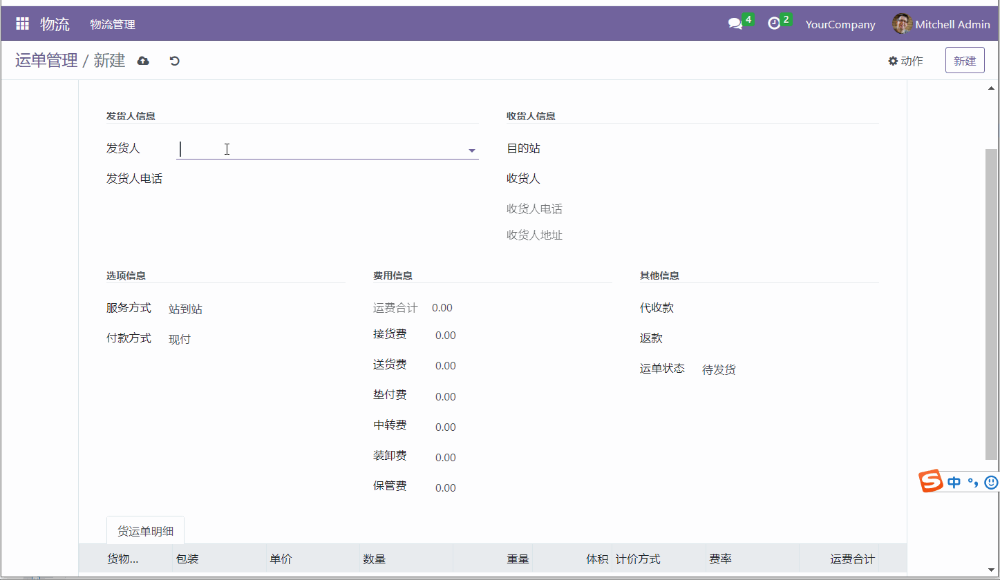
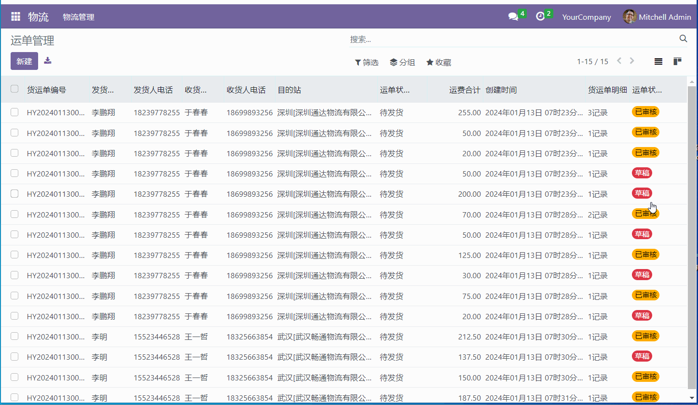
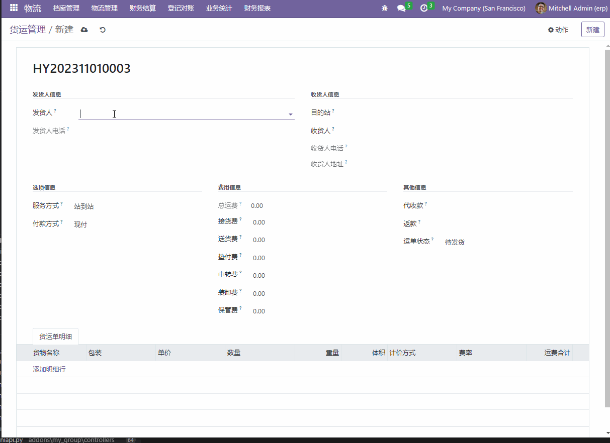

# odoo_logistics 物流管理系统更新日志

## 备注信息
- 在线访问：[http://wuliu.gardenengineer.club/](http://wuliu.gardenengineer.club/ '在线预览') 账号：wuliu@163.com 密码：123456
- QQ交流群：567961463
- 操作说明：[http://doc.gardenengineer.club/logistic/yundan.html](http://doc.gardenengineer.club/logistic/yundan.html '操作说明')
- 微信公众号： 菜园工程师
- 小程序： 账号：wuliu@163.com 密码：123456

  

## 2024-02-01
1.运单物流轨迹

- 自动添加轨迹节点
- 手动添加轨迹节点

[操作说明](http://doc.gardenengineer.club/logistic/trail.html '运单轨迹')

## 2024-01-13
1.运单管理模块完善

- 多公司及中转机制
- 运单状态及审核机制

[操作说明](http://doc.gardenengineer.club/logistic/yundan.html '运单管理')

 

2.承运管理模块

- 基本增删改查操作
- 添加数据时根据目的站初始化承运明细数据
- 承运明细数据在编辑时的动态数据过滤
- 单据状态及审核机制

[操作说明](http://doc.gardenengineer.club/logistic/chengyun.html '承运管理')

 

## 2024-01-03
1.加入odoo自带的国际化翻译机制

- 导出模块.po文件
- 使用poedit工具进行词条翻译
- .po语言包加载

[点击阅读原文](https://gardenengineer.club/2024/01/international-translation/ 'Odoo16—国际化翻译')

## 2023-12-20
1.引入odoo框架自带的权限控制机制

- 用户组分类
- 用户组
- 用户
- 菜单
- 视图
- 访问权限
- 记录规则

[点击阅读原文](https://gardenengineer.club/2023/12/odoo-access-control/ 'Odoo16—权限控制')

## 2023-11-04
1.部署在线访问预览站点：

- 地址：[http://wuliu.gardenengineer.club/](http://wuliu.gardenengineer.club/ '在线预览')
- 账号：wuliu@163.com
- 密码：123456

[点击阅读原文](https://gardenengineer.club/index.php/2023/11/logistics-online-site/ '开源物流管理系统——【3】在线站点')

## 2023-11-01
1.创建并完善货运管理模块

- 自动运单编号生成与校验
- 表单页面布局
- 货运单明细列表的实现
- 运费计算
- 发货人、收货人、目的站、货品名称、包装在创建运单时可即时新增编辑与搜索选择
- 

[点击阅读原文](https://gardenengineer.club/index.php/2023/11/logistics-waybill-management/ '开源物流管理系统——【2】货运管理')

## 2023-10-16
1.参考通过的物流管理系统整理出常用的业务菜单

[点击阅读原文](https://gardenengineer.club/index.php/2023/10/logistics-menu-organization/ '开源物流管理系统——【1】菜单整理')

